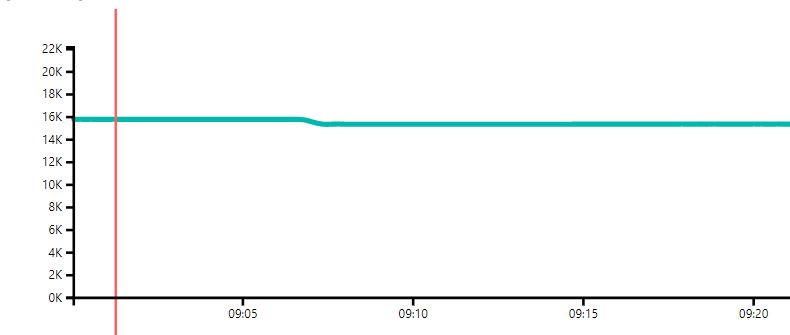

# pbiviz-cursor-highlighted-multiline-chart
Cursor highlighted multiline custom visual for Power BI

>Disclaimer: This project is just intended for testing. It is not published to the office store (with good reason), and should not be considered as a working plugin in any way.

This visual is intended to be used along with the [Play Axis](https://github.com/mprozil/PlayAxis) custom visual to step highlight the current position in a line series.

Download packaged visual: 
[cursor-highlighted-multiline-chart.pbiviz](https://github.com/KristofferBerge/pbiviz-cursor-highlighted-multiline-chart/raw/master/dist/cursor-highlighted-multiline-chart.pbiviz)